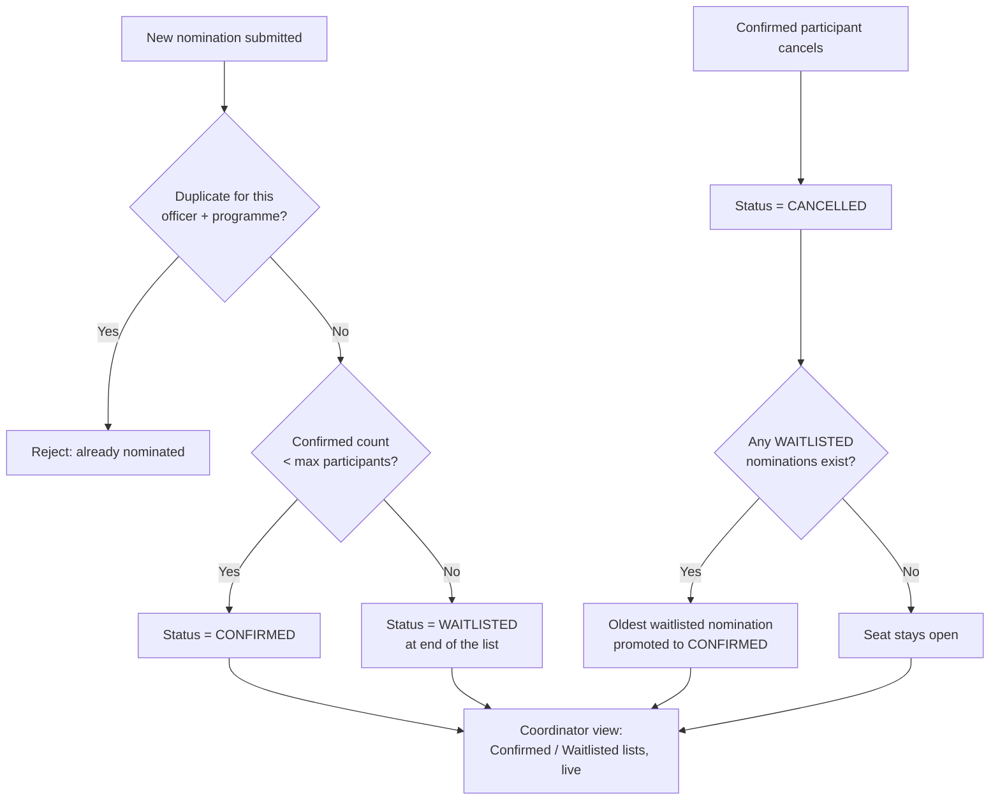

# Task 2 – Limited Training Capacity: Solution Workflow

## 1. Problem

Training programmes have a fixed maximum capacity, but nominations aren't
capped at the source — a programme with 40 seats can easily receive 60 valid
nominations. Today the coordinator resolves this **by hand**: manually
deciding who gets a confirmed seat and maintaining a separate waiting list
outside the system. That creates several problems:

- **No fixed rule.** Who gets confirmed and who's waitlisted depends on the
  coordinator's manual judgement call, not a consistent policy.
- **The waiting list lives outside the system of record** (a separate list),
  so it can drift out of sync with the actual nominations.
- **Cancellations are a manual chase.** When a confirmed participant drops
  out, someone has to remember to look at the waiting list and manually
  promote the next person — easy to forget, and slow.

**Example:** Cybersecurity Awareness Programme, maximum participants = 40,
but 60 valid nominations come in.

## 2. Decided Policy

The organization has decided nominations are processed **strictly in the
order they are received** (FIFO):

- If 40 seats are available, the **first 40 valid nominations** are
  confirmed.
- Nominations after that are placed on a **waiting list**, in the order
  received.
- If a confirmed participant **cancels**, the **first eligible person on the
  waiting list** is automatically **promoted** to confirmed.

## 3. Solution Overview

| Current process | New process |
|---|---|
| Coordinator manually decides who's in vs. waitlisted | Confirmed/Waitlisted status is **assigned automatically** at submission time, by arrival order |
| Waiting list kept as a separate, manually maintained list | Waiting list **is just the set of `WAITLISTED` nominations** for that programme — one system of record |
| Cancellation handled by manually re-checking the waiting list | Cancelling a confirmed nomination **automatically promotes** the next waitlisted person in the same transaction |
| No visible order/priority | Every nomination has a timestamp; order is derived from it, never re-typed or guessed |

## 4. Data Model

This builds on the existing `Nomination` entity (see `task01`'s workflow) —
Task 2 needs one addition: a `CANCELLED` status, so a cancelled seat is kept
in history instead of being deleted.

```
Nomination
  nomination_id
  programme_id      → TrainingProgramme
  officer_id        → Officer
  nominated_by_dept
  submitted_by
  created_at                          -- already exists; defines FIFO order
  status              (CONFIRMED / WAITLISTED / CANCELLED)   -- add CANCELLED

TrainingProgramme
  max_participants                    -- already exists
```

`created_at` is the ordering key already used by
`NominationRepository.findByProgrammeIdOrderByCreatedAtAsc` — no new "queue
position" field is needed; position is always derived from timestamp order,
so it can never drift out of sync with reality.

## 5. Confirm-vs-Waitlist Logic (on every new nomination)

This part is already implemented in `NominationService.createNomination`:

1. Reject duplicates (Task 1's existing check) first.
2. Count current `CONFIRMED` nominations for the programme.
3. If `confirmedCount < maxParticipants` → status = `CONFIRMED`.
4. Otherwise → status = `WAITLISTED`.

**Hardening needed for Task 2:** step 2–4 is currently a read-then-write with
only the transaction boundary protecting it. Under two nominations arriving
for the last open seat at the same instant, both could read
`confirmedCount < maxParticipants` as true before either commits. Make the
capacity check atomic — e.g. `SELECT ... FOR UPDATE` on the
`TrainingProgramme` row (or the equivalent row lock) inside the same
transaction as the count-and-decide step — so the last seat can only ever be
handed to one nomination.

## 6. Cancellation-and-Promotion Logic (new)

Triggered when a `CONFIRMED` nomination is cancelled (e.g.
`DELETE /api/nominations/{id}` or a status-change endpoint):

1. Load the nomination; reject if it doesn't exist or is already
   `CANCELLED`.
2. Set its status to `CANCELLED` (never hard-delete — keeps history and
   audit trail intact).
3. In the **same transaction**, find the **oldest** `WAITLISTED` nomination
   for that programme (`ORDER BY created_at ASC LIMIT 1`).
4. If one exists, set its status to `CONFIRMED` — that officer is now
   promoted, in the exact order they were waitlisted.
5. If none exists, the programme simply has one fewer confirmed participant.

Doing the cancel + promote as one transaction means there's never a moment
where the system shows an open seat that hasn't yet been offered to the
waiting list.

## 7. Process Flow



## 8. Edge Cases

- **Simultaneous last-seat nominations** — see the row-lock fix in Section 5;
  without it, two nominations could both land as `CONFIRMED` past capacity.
- **Cancelling an already-waitlisted nomination** — no promotion needed;
  simply mark it `CANCELLED` and every nomination below it in the waiting
  list keeps its existing relative order (nothing to shift, since order is
  derived from `created_at`, not a stored position number).
- **Capacity increased after nominations exist** (e.g. `maxParticipants`
  raised from 40 to 45) — the next 5 oldest `WAITLISTED` nominations should
  be promoted immediately, not only whenever the next individual cancellation
  happens to occur.
- **Promoted officer is no longer eligible** (e.g. left the department) —
  promotion should skip to the next-oldest still-eligible waitlisted
  nomination rather than blindly promoting position 1.

## 9. Why This Solves It

- **One fixed, auditable rule** (first-come-first-served by timestamp)
  replaces case-by-case manual judgement, so two coordinators would always
  reach the same decision.
- **No separate waiting list to maintain** — `WAITLISTED` nominations *are*
  the waiting list, always in sync because they're the same data the
  confirmed list comes from.
- **Cancellations resolve themselves** — the next eligible person is
  promoted automatically, in the same transaction as the cancellation, so
  there's no window where a seat is open but nobody's been told.
