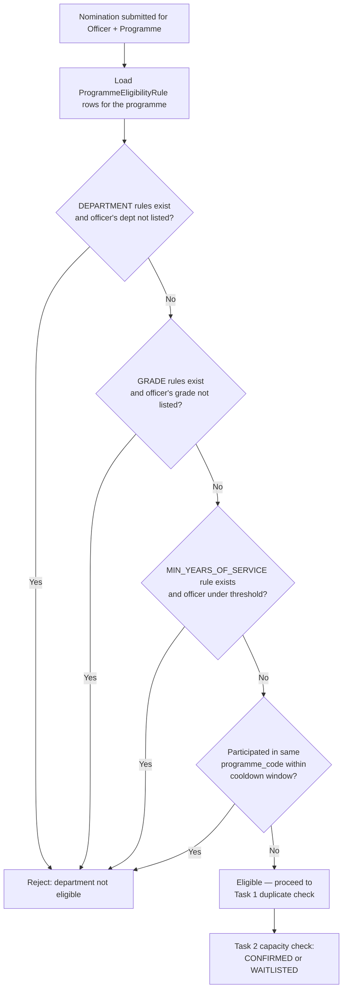

# Task 3 – Training Eligibility: Solution Workflow

## 1. Problem

Right now, any officer can be nominated for any training programme — the
system only checks for duplicates (Task 1) and capacity (Task 2). The
organization wants **eligibility rules**: only officers who meet a
programme's requirements should be nominable for it. Different programmes
need genuinely different rules:

- **Financial Management Programme** — restricted to officers in **Finance**,
  **Budget**, or **Planning**.
- **Technical Programme** — restricted to **IT** / **ICT-related divisions**.
- **Management Development Programme** — requires **a particular grade or
  designation** *and* **a minimum number of years of service**.
- **All programmes** — an officer who participated in *the same* training
  programme within the previous 12 months should not be able to register
  again.

**The constraint that actually drives the design:** eligibility rules will
change over time, and the organization explicitly does **not** want a
solution that requires touching the code every time a rule changes. That
rules out hardcoding logic like `if (programme.title.contains("Financial"))
{ ... }` — any such approach means every new programme or every changed
requirement is a code change and a redeploy.

## 2. Decided Approach

Model eligibility as **data the coordinator configures per programme**, not
logic baked into Java. A small, fixed set of **rule types** — department,
grade, minimum years of service, cooldown — covers every example given, and
a generic evaluator reads whichever rules exist for a programme and checks
the nominated officer against them. Adding a new *programme* with its own
department list, or changing an existing programme's minimum years of
service, becomes an **insert/update of data**, not a code change.

This has an honest boundary, worth stating up front: it removes code changes
for new *instances* of the four known rule types (a new department
combination, a new grade requirement, a new threshold, a new cooldown
period). It does **not** claim to anticipate every conceivable future rule
type nobody has mentioned yet (e.g. "must hold certification X") — that
would need one new rule type added to the evaluator, which is a small,
isolated change, not a rewrite. That trade-off matches what was actually
asked for: the four rule shapes in the example are exactly what's supported
with zero code changes; a genuinely new shape is one small, additive change.

## 3. Data Model

### New: `ProgrammeEligibilityRule`

```
ProgrammeEligibilityRule
  id
  programme_id      → TrainingProgramme
  rule_type           (DEPARTMENT / GRADE / MIN_YEARS_OF_SERVICE / COOLDOWN_MONTHS)
  rule_value           (department_id, grade name, or a number — see below)
```

A programme with **no rows of a given type is unrestricted on that axis** —
e.g. the Technical Programme only needs `DEPARTMENT` rows for IT/ICT; it
doesn't need to also declare "no grade restriction," absence *is* "no
restriction." Multiple rows of the same type are OR'd together (Finance OR
Budget OR Planning); different types are AND'd together (a Management
Development Programme's `GRADE` and `MIN_YEARS_OF_SERVICE` rules must
*both* be satisfied).

| rule_type | rule_value holds | Example |
|---|---|---|
| `DEPARTMENT` | a `department_id` (FK, not free text — survives renames) | Finance, Budget, Planning |
| `GRADE` | a grade/designation name | "Senior Officer" |
| `MIN_YEARS_OF_SERVICE` | an integer, as a string | "5" |
| `COOLDOWN_MONTHS` | an integer, as a string | "12" |

`COOLDOWN_MONTHS` defaults to **12** for every programme if no explicit row
exists — matching "an officer ... within the previous 12 months" being
stated as a blanket rule, not a per-programme example like the other three.
A programme can override it (e.g. set it to 0 to allow immediate
re-registration, or 24 for a stricter policy) by adding one row.

### `Officer` needs two new fields

Grade and years-of-service eligibility can't be checked today because
`Officer` doesn't carry either:

```
Officer (existing entity, two additions)
  ...
  grade                  (new — e.g. "Officer", "Senior Officer", "Director")
  joined_date             (new — LocalDate, not a stored "years of service" number)
```

`joined_date` rather than a stored `yearsOfService` count, deliberately —
the same reasoning already applied elsewhere in this codebase (nomination
order is derived from `created_at`, never stored as a position number).
A stored year-count goes stale the moment time passes and nobody remembers
to update it; a join date is a fact recorded once, and "years of service" is
always computed correctly at query time as `now - joined_date`.

### `TrainingProgramme` needs one new field: `programme_code`

The 12-month cooldown rule says "the *same* training programme," but each
`TrainingProgramme` row today is one scheduled session (it has its own
`training_date`, `venue`, `trainer`). The "Financial Management Programme"
run in March and the one run next November are the *same programme* for
eligibility purposes but two different rows. Matching on `title` text is
fragile (a typo or reword breaks the link silently), so:

```
TrainingProgramme (existing entity, one addition)
  ...
  programme_code         (new — e.g. "FIN-MGMT", stable across every
                           scheduled session of "Financial Management
                           Programme"; title can still change freely)
```

The cooldown check groups by `programme_code`, not `title` or `id`.

## 4. Eligibility Evaluation (runs inside `NominationService.createNomination`, before the existing duplicate/capacity checks)

For the officer and programme in the request:

1. Load every `ProgrammeEligibilityRule` for the programme, grouped by
   `rule_type`.
2. **`DEPARTMENT`** rows exist and officer's department isn't one of them →
   reject: *"Officer's department is not eligible for this programme
   (requires: Finance, Budget, Planning)."*
3. **`GRADE`** rows exist and officer's grade isn't one of them → reject
   with the required grade(s) listed.
4. **`MIN_YEARS_OF_SERVICE`** row exists and
   `now - officer.joinedDate < threshold` → reject: *"Requires at least 5
   years of service; officer has 3."*
5. **`COOLDOWN_MONTHS`** (explicit row, or the default of 12) — look up the
   officer's most recent `CONFIRMED` nomination for any `TrainingProgramme`
   sharing this one's `programme_code`, whose **session date** (not the
   nomination's `created_at` — the officer participated on the *training*
   date, not the day they registered for it) falls within the cooldown
   window → reject: *"Officer already participated in this programme on
   2025-11-03; not eligible again until 2026-11-03."*
   `WAITLISTED` or `CANCELLED` nominations don't count — the officer never
   actually attended.
6. All checks pass (or the programme has no rules at all — fully open) →
   proceed to the existing duplicate-nomination and capacity checks
   unchanged.

Failing any check throws a new `IneligibleOfficerException`, handled the
same way `DuplicateNominationException` already is — a clear message, no
stack trace, an appropriate HTTP status (409, since it's a conflict with a
business rule rather than a malformed request).

## 5. Managing Rules (so this is genuinely configuration, not a migration)

Rules need to be viewable and editable without a deploy:

- `GET /api/programmes/{id}/eligibility-rules` — list a programme's rules.
- `POST /api/programmes/{id}/eligibility-rules` — add one
  (`{ ruleType, ruleValue }`).
- `DELETE /api/programmes/{id}/eligibility-rules/{ruleId}` — remove one.

A coordinator sets up "Management Development Programme" by adding a
`GRADE` row and a `MIN_YEARS_OF_SERVICE` row through this API (or a small
admin UI on top of it) — no code change, no redeploy, exactly the
requirement in section 1.

## 6. Process Flow



## 7. Edge Cases

- **Programme with zero rules** — every officer is eligible; this keeps all
  of Task 1 and Task 2's existing programmes (which have no eligibility
  concept today) working unchanged after this ships.
- **Existing officers have no `grade` / `joined_date`** — both new columns
  need to be nullable (or backfilled) on migration; an officer with a null
  `grade`/`joined_date` should fail a `GRADE`/`MIN_YEARS_OF_SERVICE` check
  closed (treated as ineligible, with a message asking HR to complete their
  record) rather than silently passing it open.
- **A programme reused across years with a title rename** — still tracked
  correctly by `programme_code`, which is what the cooldown groups on, not
  the (freely editable) `title`.
- **Multiple `DEPARTMENT` rows** — OR semantics (Finance **or** Budget
  **or** Planning), not AND; an officer only needs to match one.
- **Rule added *after* nominations already exist** — this only gates *new*
  nominations going forward; it deliberately doesn't retroactively cancel
  nominations that were valid under the old (or absent) rules.

## 8. Why This Solves It

- **Rules live in the database, not in `if` statements** — the exact
  requirement stated in the source material: new eligibility criteria for a
  new or existing programme is a data change, not a software change.
- **Four rule types cover every example given**, composed generically
  (AND across types, OR within a type) rather than one bespoke check per
  named programme.
- **The 12-month rule is a sensible default, not a special case** — every
  programme gets it automatically, and any programme that needs a different
  window overrides it with one row, instead of that logic being duplicated
  or hardcoded per programme.
