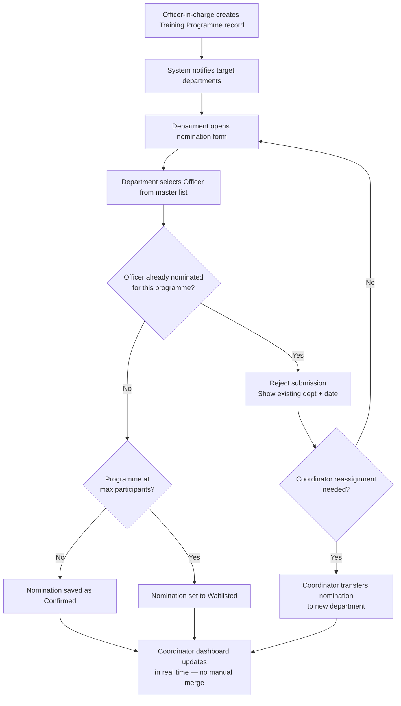

# Task 1 – Duplicate Nominations: Solution Workflow

## 1. Problem

Departments currently nominate officers for training programmes independently,
by email, into separate Excel sheets. The training coordinator then merges
these sheets **by hand**. When an officer (e.g. *A. Perera*) is nominated by
more than one department (e.g. Finance and Administration) for the same
programme, the duplicate is only caught if the coordinator happens to spot it
while merging - which becomes unreliable once a programme has 50–100
nominations.

**Root cause:** there is no single shared record that a nomination is checked
against *before* it is accepted. Every department works from its own copy of
the truth.

## 2. Solution Overview

Replace "nominate independently → merge by hand → spot duplicates" with
"nominate into one shared list → system blocks duplicates the instant they
happen."

| Current process | New process |
|---|---|
| Each department keeps its own Excel nomination list | All departments nominate into **one shared nominations table** |
| Officers identified by typed name | Officers selected from a **master Officer list** by unique Officer ID |
| Duplicates found by manually scanning merged sheet | Duplicates **blocked at the point of entry**, before they're saved |
| Coordinator discovers duplicates late (after merging) | Coordinator dashboard shows a **live, already-deduplicated** list |

## 3. Key Data Model

```
Officer
  officer_id      (unique, e.g. employee number/NIC)
  name
  department_id

TrainingProgramme
  programme_id
  title
  date
  venue
  trainer
  max_participants
  target_departments

Nomination
  nomination_id
  programme_id      → TrainingProgramme
  officer_id        → Officer
  nominated_by_dept
  submitted_by
  timestamp
  status              (Confirmed / Waitlisted / Withdrawn)

  UNIQUE (officer_id, programme_id)   -- hard DB constraint
```

The `UNIQUE (officer_id, programme_id)` constraint is the safety net: even if
application logic has a bug or historical data is bulk-imported, the database
itself will never store two active nominations for the same officer on the
same programme.

## 4. Duplicate-Check Logic (applied on every nomination submission)

1. Department selects an **officer_id** (from the master list) and a
   **programme_id** - never free text.
2. System queries: does a `Nomination` already exist for this
   `(officer_id, programme_id)` pair?
   - **No match** → nomination is saved, status = *Confirmed*, participant
     count for the programme is incremented.
   - **Match found** → submission is **rejected immediately**, and the
     submitting department sees:
     *"Officer [name] was already nominated for this programme by
     [department] on [date]."*
3. If the requesting department believes the nomination should be
   reassigned to them (genuine edge case, not a duplicate), they contact the
   coordinator, who can **transfer** the existing nomination's
   `nominated_by_dept` field rather than create a second row.
4. If a programme reaches `max_participants`, further nominations are placed
   in a **Waitlisted** state instead of being silently accepted.

## 5. Process Flow



## 6. Handling Legacy / Migration Data

Existing Excel-based nomination history won't have Officer IDs attached.
During one-time migration:

1. Match historical rows to the master Officer list using
   Name + NIC/Employee No + Department (fuzzy match).
2. Any row that can't be confidently matched is flagged for manual review
   by the coordinator, once — not repeated every programme cycle.
3. After migration, all *new* nominations go through the ID-based flow in
   Section 4, so this manual step is never needed again going forward.

## 7. Why This Solves It

- **Prevention, not detection**: duplicates are blocked at submission time,
  not discovered afterward.
- **No ambiguity**: officers are matched by ID, not by name spelling/format.
- **No manual merge step**: the coordinator's "combined list" already exists
  and is always up to date, removing the O(n²) manual cross-check that
  breaks down at 50–100 nominations per programme.
- **Auditable**: every nomination records who submitted it and when, so
  disputes (e.g. which department nominated an officer first) are answered
  by the data, not memory.
